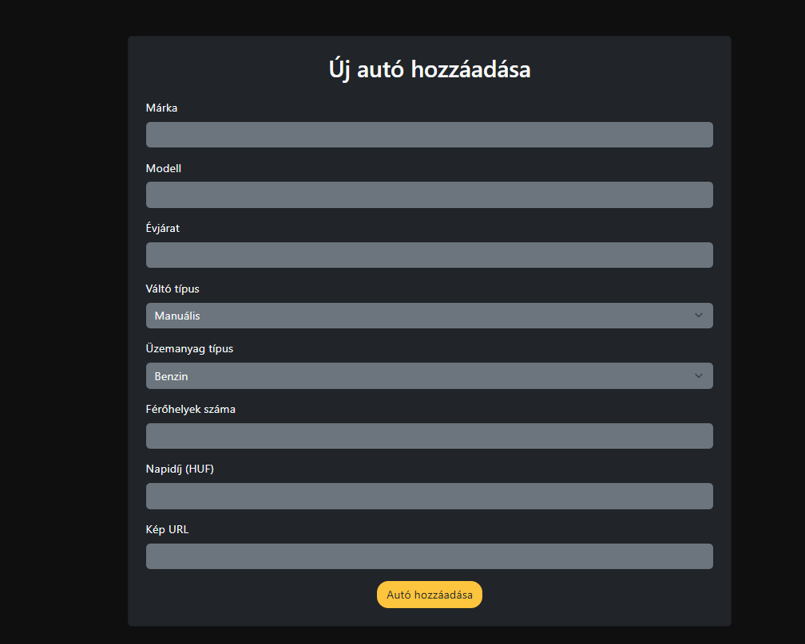

# 🚗 Car Rental Application

A PHP web application for renting cars online. This project allows users to browse available cars, filter by various criteria, register accounts, make reservations, and manage their profiles. Admin users have additional capabilities to manage the car inventory.

[](https://github.com/raczkodavid/Car-Rental)

## ✨ Features

- **User Authentication**

  - Register new accounts
  - Login with existing accounts
  - Session management

- **Car Browsing**

  - View all available cars
  - Filter cars by various criteria (brand, model, transmission, etc.)
  - View detailed information about each car

- **Reservation System**

  - Reserve cars for specific dates
  - View and manage your reservations
  - Cancel reservations

- **Admin Panel**
  - Add new cars to the fleet
  - Modify existing car details
  - View all user reservations
  - Manage the car inventory

## 🚀 Getting Started

### Prerequisites

- PHP 7.4 or higher
- Composer (PHP package manager)

### Installation

1. Clone the repository:

   ```bash
   git clone https://github.com/raczkodavid/Car-Rental.git
   ```

   or download and extract the ZIP file.

2. Navigate to the project directory:

   ```bash
   cd Car-Rental
   ```

3. Install dependencies:

   ```bash
   composer install
   ```

4. Start the PHP development server:

   ```bash
   php -S localhost:8000 -t public
   ```

5. Open your browser and navigate to:
   ```
   http://localhost:8000
   ```

## 📖 Usage

### Regular Users

1. **Browse Cars**: View all available cars on the homepage
2. **Filter Cars**: Use the filter options to find cars that match your preferences
3. **Register/Login**: Create an account or login to an existing one
4. **Car Details**: Click on a car to view more details
5. **Make Reservation**: Select your desired dates and reserve a car
6. **View Profile**: Access your profile to view and manage your reservations

### Admin Users

Admins have all the capabilities of regular users, plus:

1. **Add Cars**: Add new cars to the rental fleet
2. **Modify Cars**: Update information for existing cars
3. **Manage Inventory**: Control the available car inventory

## 📸 Screenshots

### Homepage & Car Browsing


### Car Details


### Reservations


### Admin




## 🔑 Test Credentials

### Admin Account

- **Email**: admin@ikarrental.hu
- **Password**: admin

### Regular User Account

- **Email**: test@user.com
- **Password**: password123

_Note: If the above credentials don't work, you can register a new account through the registration page._

## 💾 Data Storage

This application uses JSON files for data storage, located in the `src/Models/Data` directory:

- `users.json` - User account information
- `availableCars.json` - Car inventory details
- `reservations.json` - Reservation records

## 📁 Project Structure

```
public/
 ├── index.php         # Entry point for the application
 └── css/
     └── style.css     # Styling for the application

src/
 ├── Controller.php    # Base controller class
 ├── Router.php        # Handles URL routing
 ├── Controllers/      # Controller classes for different features
 ├── Models/           # Data models and services
 ├── Utils/            # Utility functions
 └── Views/            # PHP templates for rendering pages
```

### Local Testing

To test the application locally before deployment:

```bash
php -S localhost:8000 -t public
```

## About

This project was created as an assignment for the Web Programming course at ELTE University.

## Author

- **Name**: Raczkó Dávid
- **Email**: [raczkodavid@gmail.com](mailto:raczko.david@gmail.com)
